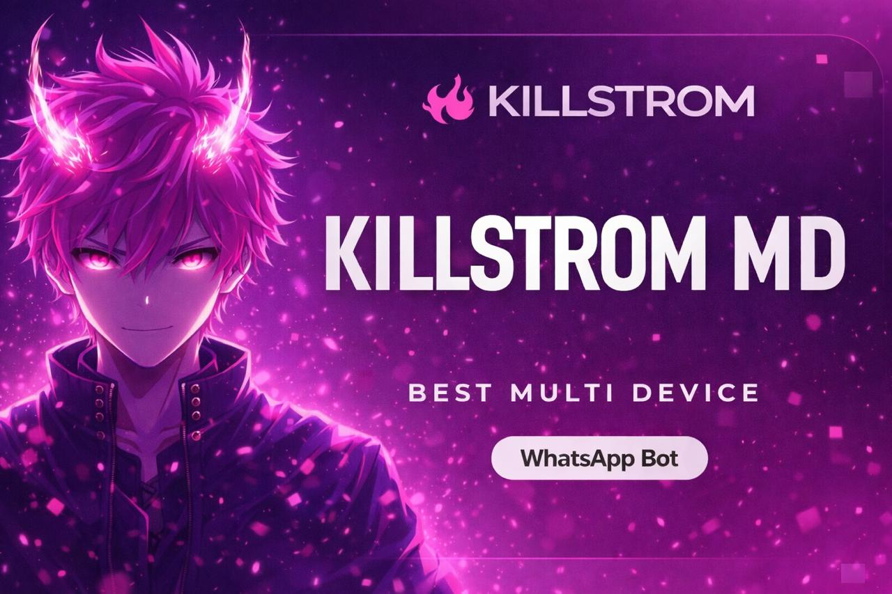

<div align="center">

## 𝐊𝐈𝐋𝐋𝐒𝐓𝐑𝐎𝐌 𝐌𝐃

[](https://github.com/WhiskeySockets/Baileys)
[](https://nodejs.org/)
[](LICENSE)



</div>

𝐊𝐈𝐋𝐋𝐒𝐓𝐑𝐎𝐌 𝐌𝐃 is a fast and lightweight **WhatsApp MD bot** built on top of the **Baileys** library.  
Fully open-source and easy to customize without touching the core code.  
Change **bot image, prefix, name, commands**, and more with simple commands.

---

# 🚀 Deployment Options

<p align="center">
  <!-- Deploy to Heroku Button -->
  <a href="https://www.heroku.com/deploy?template=https://github.com/killstrombotz/KILLSTROM-MD">
    
  </a>
</p>

<p align="center">
  <!-- Deploy to Render Button -->
  <a href="https://render.com/deploy?repo=https://github.com/killstrombotz/KILLSTROM-MD">
    
  </a>
</p>

<p align="center">
  <!-- Deploy to Koyeb Button -->
  <a href="https://app.koyeb.com/deploy?type=git&repository=github.com/killstrombotz/KILLSTROM-MD">
    
  </a>
</p>

<p align="center">
  <!-- Get Postgres Database Button (Cockroach Labs) -->
  <a href="https://cockroachlabs.cloud/">
    
  </a>
</p>

---

# ⚡ Installation

```bash
git clone https://github.com/iTx-Sarkar/SMD-MINI
cd SMD-MINI
npm install
npm start
```

---

## ✨ Features

- **Fully Open Source** – edit the codebase, host anywhere (VPS, panel, Heroku, etc.).  
- **Easy Customization via Commands** – update **bot name, image, prefix, pair code** on the fly.  
- **Modular Command System** – all commands in the `commands` folder for easy management.  
- **Optimized Stability** – RAM-efficient media handling, sessionID management.  
- **Owner Tools** – restart, update from ZIP, and other admin commands.

---

### 1️⃣ Fork the Repository

<div align="center">

<a href="https://github.com/killstrombotz/KILLSTROM-MD/fork" target="_blank">
  
</a>

</div>

---

### 2️⃣ Get Pair Code

<div align="center">

<a href="https://your-repl-name.your-username.repl.co" target="_blank">
  
</a>

</div>

> Session string example:  

```text
killstrombotz/KILLSTROM-MD
